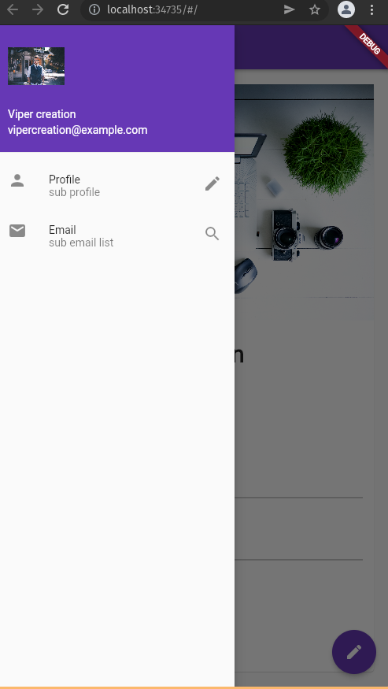

# flutter for learning

# Description

This is a simple flutter applications for beginner.It consists of chapter wise details as a begineers friendly manner.

- dev-chap1 : setup flutter and scallfold widgets
- dev-chap2-row-column : row column property in flutter
- dev-chap3-materialdrawer : material drawer for sidebar
- dev-chap4-homepage - simple homapge

## screenshots

